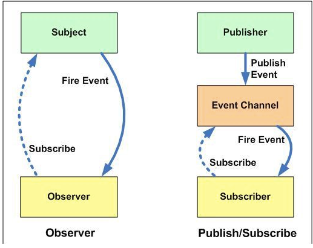

## 관찰자 패턴(observer)

#### 정의

- 한 객체의 상태가 바뀌면 그 객체에 의존하는 다른 객체들에게 정보가 자동으로 갱신되는 방식

##### 주체(subject)

- 이벤트를 발생 시키는 역할
- subject는 옵저버(관찰자)가 무슨 행동을 하는지 알 수 없음

##### 관찰자(observer)

- 이벤트를 수신  , 감지하는 역할
- 옵저버는 언제든지 추가 될 수 있으며 제거 가능하며 주체에 영향을 주지 않느다(느슨한 결합도)

`` 보통 ui 라이브러리에서 많이 사용하고 우리가 흔히 아는 mvc에서 사용``

##### 이외

- 주체와 관찰자는 1:n , 1:1 관계를 맺을 수 있으며 런타임 시 의존성을 등록 할 수 있다.
- pull 방식과 push 방식 이존재
  - push -> 주체가 변경 노티 + 데이터
  - pull -> 주체가 noti해주면 옵저버가 데이터를 받아가는 형식

##### 단점

- 순서 보장 없음
- 이벤트 손실의 문제점(observer가 subject에 등록되기전 이벤트 발생)
- 스레드 환경에서 문제가 될 수 도있고 콜백을 제대로 제거 하지 않으면 리소스 낭비

## 발행구독 패턴

##### 정의

- 발행-구독 패턴은 비동기 메시징 패러다임이다. 발행-구독 모델에서 발신자의 메시지는 특별한 수신자가 정해져 있지 않다. 대신 발행된 메시지는 정해진 범주에 따라, 각 범주에 대한 구독을 신청한 수신자에게 전달된다. 수신자는 발행자에 대한 지식이 없어도 원하는 메시지만을 수신할 수 있다. 이러한 발행자와 구독자의 디커플링은 더 다이나믹한 네트워크 토폴로지와 높은 확장성을 허용한다

- 옵저버 패턴과 유사

